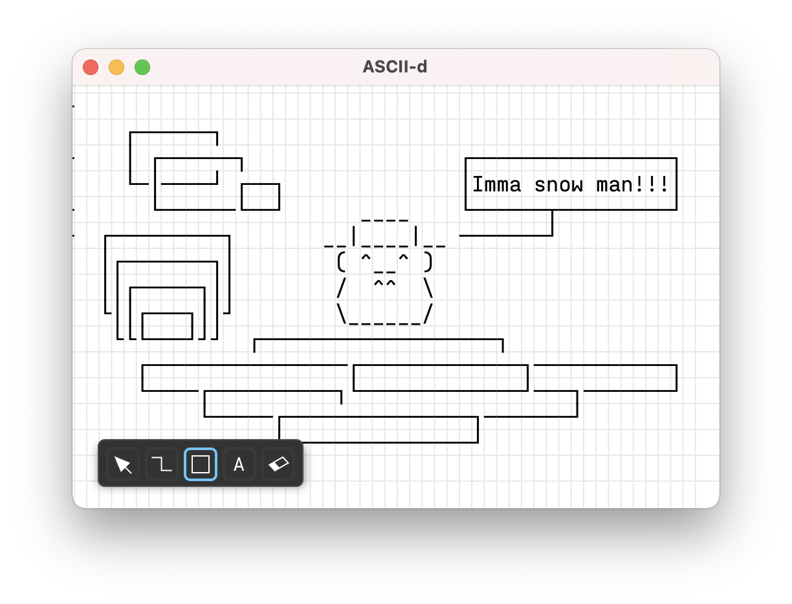
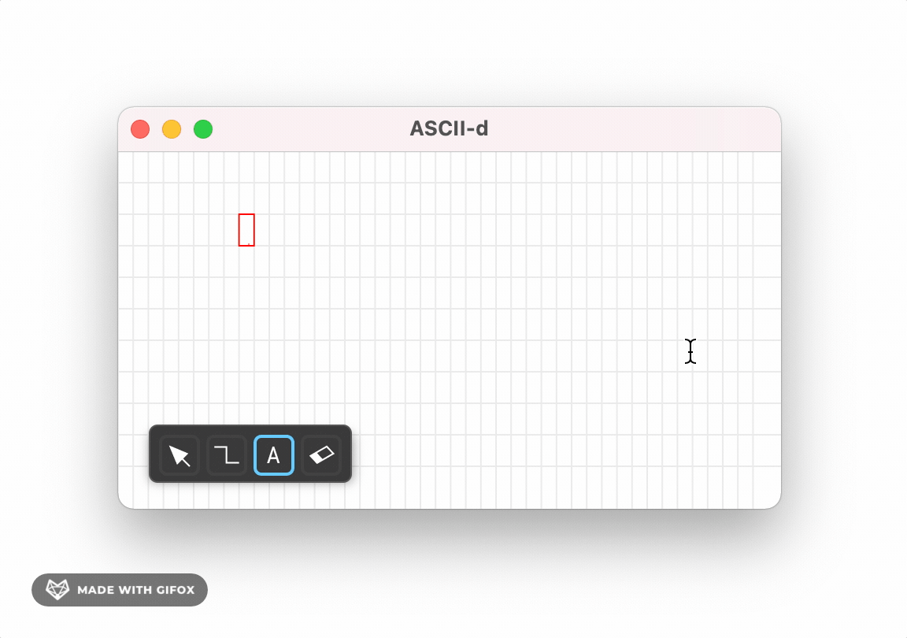
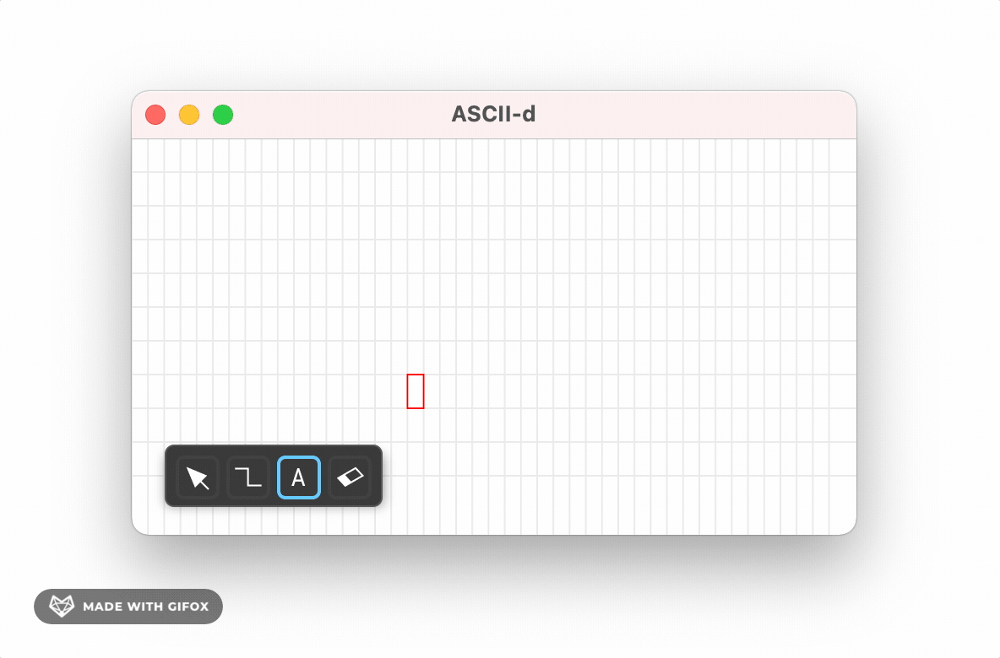
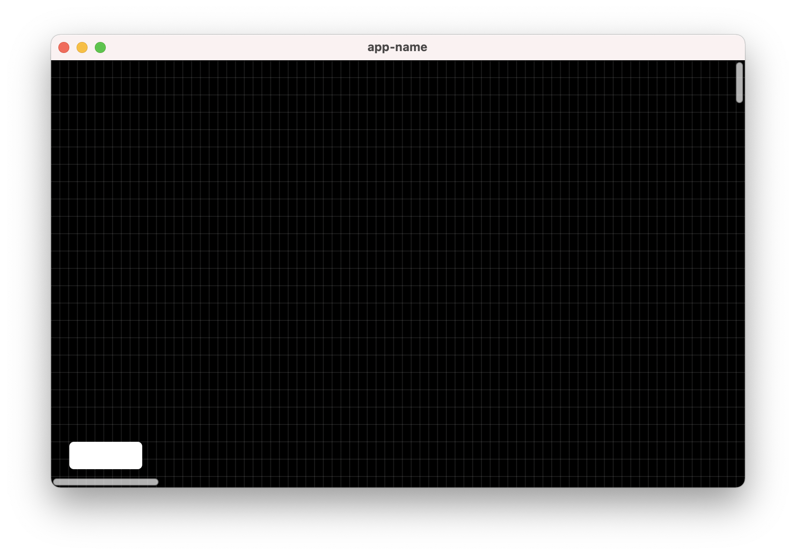
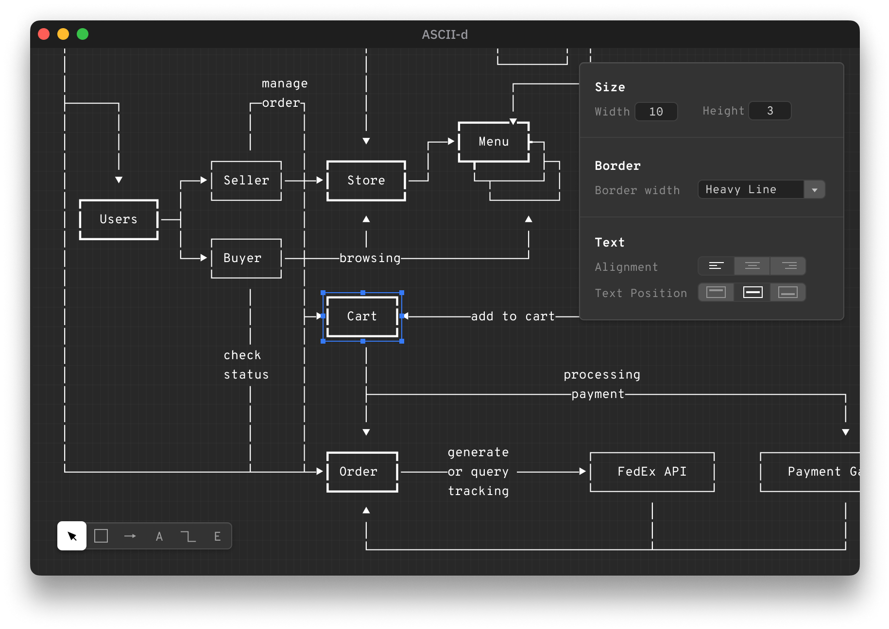

# Feb 22, 2023

Opened up the project after a long break, all the code seems to started making more sense, lol.

So I think it would be a good idea to dust it off a little bit.


Now, ASCII-d can save and load from any text file. I guess I'll go with `.txt` format from now
on.

There are some problems though:

1. The file loading is slow on the first load, and become faster on subsequence loads. Not sure why.
2. The loaded content does not have any shape data, so it would be loaded as a flat string. Still have no idea how to go about this...

But overall, the app is usable enough. I'll dogfooding for a while and see what can be improved.

Had to update Druid to version `v0.8.2`. I was planning to stick on `0.7.0` because I don't want to deal with
API changes, but ran into a serious issue that makes the app crash after opening the Save dialog ([druid#2213](https://github.com/linebender/druid/pull/2213)).

# Mar 20, 2022

I don't know why did I wait for so long to implement this.

Before, if the window is closed, the app keeps running. Druid intentionally implements this behavior to support multiple windows applications. ASCII-d is not designed to be a multi-window app so it's not necessary.

The fix was simple, I just need to add a delegate to the `AppLauncher`, the `window_removed()` method will be called every time we close a window. When that happens, I just need to terminate the app.

# Dec 22, 2021

Today I implemented another shape drawing feature, Rectangle Tool (or `RectTool`)! Now we can draw boxes everywhere.



The way `RectTool` works is pretty much like `LineTool`. A new `RectShape` will be created when the tool starts. When the user drags their mouse, the end point of the `RectShape` will be recorded.

Let's call the four corners of the rectangle as A, B, C, and D. There are 4 cases that could happen when the user draw:

```
 A                         B
 (sx, sy)------------------+
 |                         |  (Draw from A -> D)
 |                         |
 +------------------(ex, ey)
 C                         D


 A                         B
 (ex, ey)------------------+
 |                         |  (Draw from D -> A)
 |                         |
 +------------------(sx, sy)
 C                         D


 A                         B
 +------------------(sx, sy)
 |                         |  (Draw from B -> C)
 |                         |
 (ex, ey)------------------+
 C                         D


 A                         B
 +------------------(ex, ey)
 |                         |  (Draw from C -> B)
 |                         |
 (sx, sy)------------------+
 C                         D
```

Whatever case it is, to draw a rectangle on the main grid, we need to draw from left to right, top to bottom, so, here's how I find the top-left and bottom-right points for drawing:

```
from_x = Min(sx, ex)
from_y = Min(sy, ey)
to_x = Max(sx, ex)
to_y = Max(sy, ey)
```

Now, what needs to be done is draw the four lines: AB, CD, AC, and BD.


# Dec 17, 2021

Okayyy, I finally make the text editing experience feels better. By changing a lot in the `TextTool`. But let's take a step back and review what was the issue with the initial implementation.

Previously, each line of text is a `TextShape`, when the user inserted a text (by clicking on any grid cell), a new `TextShape` will be created. All subsequence edits will modify the attached string of that shape. During the rendering phase, the last created `TextShape` will get rendered on the screen. Once the user stopped the text edit (by switching to another tool), the current `TextShape` will be committed.

```
 ┌──────────────┐
 │Text Edit Tool│
 └─────┬────────┘
       │              ┌────────────┐            ┌───────────┐
       ├──start()────►│ Text Shape ├──render()──► Main Grid │
       │              └─────▲──────┘            └───────────┘
       │                    │
       └─keyboard input ────┘
```

This approach works fine, but in the next iteration, I want to support cursor moving — the user can freely move the cursor and insert new text anywhere around the grid while editing. To do this, it will make more sense if we insert text based on the cursor, instead of grouping them with `TextShape`.

So I decided to just remove the `TextShape`, from now on, `TextTool` will manage a Cursor, the new text will be inserted directly into the grid, at Cursor's position.

```
 ┌──────────────┐
 │Text Edit Tool│
 └─────┬────────┘
       │
       └─keyboard input
           │                                 ┌───────────┐
           └────────► Cursor ─────►render()──► Main Grid │
                                             └───────────┘
```

This approach enabled some improvement in the editing experience, for example, we can move the cursor around with arrow keys and insert text anywhere:



And just like in normal text editors, hit Enter will move the cursor to the new line, the start column of the last inserted text will be used as an anchor for the new line:



Well, that's it for today. See you in later updates.

# Dec 14, 2021

It turned out Druid didn't have built-in support for Image inside a Button, lol, so I need to build a custom `ImageButton` widget. Most of the implementations are copied from the built-in Button widget.


Each `ImageButton` is created with a tag. Every time we click a button, we send a `Notification` from that button, with its tag to the parent widget. We pass down the `Command` with that tag to all the `ImageButton` from the parent widget. If an `ImageButton` finds the matching Command with its tag, it will be highlighted.

```
   ┌─────────────────┐
   │ toolbar widget  │
   └─────────────────┘
       ▲
       │ Notification(BUTTON_HIGHLIGHT)
       ├────────┬──────────┐
       │        │          │
   ┌───┴──┐  ┌──┴───┐  ┌───┴──┐
   │btn_1 │  │btn_1 │  │btn_1 │
   └──────┘  └──────┘  └──────┘

   ┌─────────────────┐
   │ toolbar widget  │
   └───┬─────────────┘
       │
       │ Command(BUTTON_HIGHLIGHT)
       ├────────┬──────────┐
       │        │          │
       ▼        ▼          ▼
   ┌──────┐  ┌──────┐  ┌──────┐
   │btn_1 │  │btn_1 │  │btn_1 │
   └──────┘  └──────┘  └──────┘
```

Honestly, I still don't like how tags are treated as `ImageButton` main property. That's something to be refactored later.

# Dec 11, 2021

Well, it almost took me a month to finish the text edit function. I had to make many underlying changes like rewriting `GridList` and `ShapeList` types to manage the interaction between `Tool` `Shape` and the actual list. More on this in [ARCHITECT.md](ARCHITECT.md).


Getting back to this project after a month-long break, at first, it seemed like I'd run out of motivation to keep working on ASCII-d, but it looks like that's because of the messy code I left over before the break. After a few days to clean them up, solve most of the remaining text editing issues. Now I'm back on track.

I decided to change the UI from dark theme to light. Now that the basic functionalities are ready, it's time to focus more on the UI. The next update will be about the toolbar.

# Nov 2, 2021

The idea is, each drawable shape (line, rectangle, arrow,...) will have
its own Tool object, and there is a ToolManager to manage them all, pass
the current mouse input from the grid into the active tool.

The list of the available tools should be fixed and pre-allocated at
compile time. But it can be dynamic too, just not something to worry about
at this moment.

Each tool will implement the `ToolControl` trait, which defined the three
stages of each drawing behavior:

- start(): called when the user started drawing
- draw(): called when the user is drawing with their mouse down
- end(): called when the user finished drawing, with their mouse up

Each stage could modify the data buffer directly.

```
               ┌──────────────┐
 MouseDown────▶│              ├─────▶start()
 MouseMove────▶│ ToolManager  ├─────▶draw()
   MouseUp────▶│┌────────────┐├─────▶end()
               └┤Active Tool ├┘
                └────────────┘
```

The first tool in this commit is `LineTool`, to draw a straight line between
the start and current mouse position.

# Nov 1, 2021

Well, there are a lot going on in this commit. The app now render
things like background grid or other content based on the visible
area only, not the whole canvas.

The second thing is some early PoC for a reusable character layout,
previously, we use grid_text to render the whole data buffer to the
screen, it requires a lot of text layout update, rebuild, clone the
screen buffer into a new string on EVERY FUCKING MOUSE MOVE! With the
new approach, all box drawing characters which will be rendered on the
screen will be pre-built and never be built again during runtime.

More on the next commit.

# Oct 21, 2021

Before the current version, I’ve been trying to prototype ASCII-d using different languages/tech stack, one of them is the obvious choice: Electron. Just to get a glimpse of how my idea looks in action.


React and Electron is a great option to start a quick prototype, but long term wise, I don’t want to ship a 100 MB application that needs to spawn 5 different browser processes.

In this prototype, I got a lot of core functionalities working: Line drawing, automatic corner adjustment, text editing, … and this helped me foresee a lot of problems when I actually start making ASCII-d happen for real (in Rust).

Prior to ASCII-d, I worked on [a Terminal Emulator](https://github.com/huytd/snarkyterm/) using Rust and [WebGPU](https://github.com/gfx-rs/wgpu), so, reuse this stack seems like a natural decision. With the help of [wgpu_glyph](https://github.com/hecrj/wgpu_glyph/), text rendering — the core of ASCII-d, since everything is just text, rendered on a grid, made easy. But building GUI app is not just text, and there are a lot of manual handling when using WebGPU that I don’t like. So, here come my next option: [Druid](https://github.com/linebender/druid).

Druid is a very efficient framework for building GUI app in Rust. With a lot of built-in widgets, flex-based layout algorithm and the most important: The ability to let me control every single pixels if I decided to build a custom widget! Everything sounds like it’s a destined choice for ASCII-d!

The very first moment of today’s ASCII-d:



Suddenly one of the stretch goals from the initial plan — unlimited canvas, solved for free! With the help of Druid’s [Scroll Widget](https://docs.rs/druid/0.7.0/druid/widget/struct.Scroll.html)!

Well, there are some downsides of choosing Druid too. First, text rendering mechanism in Druid is not as flexible as using wgpu_glyph. You’re required to recalculate the layout every time you want to render some text on the screen, which is unnecessary in my case. I’m rendering each character individually on the grid, so no layout calculating needed!

Another thing, Druid development seems heavily focused on Windows currently — and I don’t develop on a Windows machine! A lot of MacOS specific features are still WIP. For example, in most of the Rust GUI ecosystem, people using [winit](https://github.com/rust-windowing/winit) for window handling. Druid uses its own window handling library. Many of the problems are solved in winit but for Druid we have to wait.

Anyway, it's still a good choice for applications like ASCII-d. So let just use it.

That’s it for today, see you on the next update!

# Oct 10, 2021

It’s been a while since my last attempt to start a SaaS, and I’m starting a new project, this time, I’ll be building ASCII-d, a tool for drawing ASCII diagrams.

You can think about it as an alternative of Monodraw — I love it, with the focus for a more minimal UI and support more platforms (Windows, MacOS and Linux).

Here’s how it gonna look like:



Ultimately, I’m going to publish this application to stores, but it will be open source too, so, if you don’t want to pay, just grab the code and build it.

After various experiments, I will be using Rust and Druid for this project.

You can follow the development progress by subscribe to this newsletter, and watch this project on GitHub too: https://github.com/huytd/ascii-d

That’s it for today, I’ll be back with more update!
